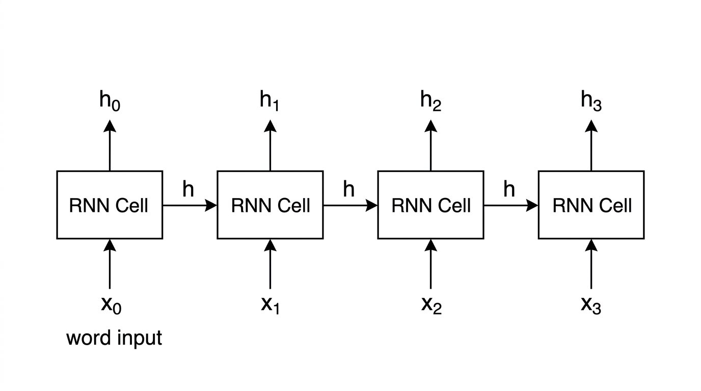

# 06: Sequence Models and Attention

Embeddings gave each word a position in a meaningful space. But every word was still processed independently — one embedding per word, no connection between them.

The problem this left open: meaning often depends on what came before.

- "not good" — BoW treated these as two independent words and got the sentiment wrong
- "The cat sat on the mat because **it** was tired" — which word does "it" refer to?
- "The bank near the **river**" — the word "bank" means something different here than in "the bank near the office"

N-grams tried to handle local order, but only within a short window. Embeddings captured word meaning, but not word relationships within a sentence.

What the field needed was a model that could read a sentence from left to right and carry information forward as it went.

That is what RNNs were built to do.

---

## Why RNNs Came

Before RNNs, the best approach to sequence tasks was:

- n-gram models → only look at the last 2-3 words
- embeddings → represent each word independently, no context

Neither could handle dependencies that spanned more than a few words. And neither had a way to build up a representation of a sentence as a whole.

The insight behind RNNs: process the sentence one word at a time, and at each step, combine the new word with everything you have seen so far. That combination becomes the input to the next step.

---

## What "Recurrent" Means

Sequence models are called **recurrent** because they loop — the output of one step feeds back as input to the next.

At each step, the model takes:
1. the current word's embedding (x)
2. the hidden state from the previous step (h)

And produces a new hidden state.



Reading the diagram left to right:

- `x0, x1, x2, x3` — the word embeddings fed in at each step
- `h` arrows flowing right — the hidden state being passed forward
- `h0, h1, h2, h3` — the hidden state output at each step (which can be read off for tasks like labeling each word)

The hidden state is a fixed-size vector — a compressed summary of everything the model has read so far.

In concrete terms for "The cat sat":

```
Step 1:  embed("The")  + h_start (zeros) → h_1
Step 2:  embed("cat")  + h_1             → h_2  ← now carries "The cat"
Step 3:  embed("sat")  + h_2             → h_3  ← now carries "The cat sat"
```

Each step updates the hidden state with new information. The model must read words in order — step 3 cannot run until step 2 is done.

---

## What RNNs Solved

Compared to what came before, RNNs made real progress on problems that had no solution in the n-gram or embedding era.

**Negation in sentiment:**

BoW for "The movie was not bad":
- vector: `{movie:1, not:1, bad:1}` → "bad" scores negative → wrong

RNN for "The movie was not bad":
- step 1: reads "The" → h_1
- step 2: reads "movie" → h_2
- step 3: reads "was" → h_3
- step 4: reads "not" → h_4 ← hidden state now carries a negation signal
- step 5: reads "bad" → h_5 ← hidden state combines negation + negative word

The model can learn from training data that this sequence pattern (negation + negative word) tends to appear in positive reviews. BoW had no way to encode that the words appeared in that order.

**Co-reference resolution:**

For "The cat sat on the mat because it was tired" — an RNN reaches "it" with a hidden state that has been updated by every word before it, including "cat" and "mat." Through training, the model learns to keep track of the subject of the sentence and use that to resolve "it."

**Language modeling beyond a short window:**

N-grams with N=3 can only use the last 2 words as context. An RNN, at any step, has a hidden state that was built from the entire sequence so far — not just the last few words.

---

## What RNNs Could Not Do

Two problems limited RNNs.

**The hidden state bottleneck:**

The hidden state is a fixed-size vector regardless of how long the sentence is. For a 3-word sentence it is fine. For a 40-word sentence, the model is trying to compress 40 words of information into the same fixed-size vector.

Early information gets overwritten. Consider:

"The tourist who arrived from Spain, after a long flight through three different airports, finally reached the hotel where the ___ had been reserved."

By the time the model reaches "___", the hidden state has been updated 15 times since "tourist." The information may be gone.

**Vanishing gradients:**

Training an RNN requires backpropagating through every step of the sequence. As established in ch05, gradients shrink as they travel backward through layers. In a long sequence, the gradient for step 1 has to travel through 40 backpropagation steps — and it fades to near zero. The model cannot learn long-range connections.

---

## LSTMs: Solving the Forgetting Problem

Take the sentence that showed where RNNs broke:

"The tourist who arrived from Spain, after a long flight through three different airports, finally reached the hotel where the ___ had been reserved."

With a basic RNN, by the time the model reaches "___", the hidden state has been rewritten 15+ times since "tourist." The word that matters for completing the sentence — the subject — may have largely faded from the hidden state.

The **LSTM** (Long Short-Term Memory) was built to fix this.

Instead of one hidden state that gets fully rewritten at every step, LSTMs maintain two separate pieces of memory:

- **hidden state** — short-term, what to expose right now
- **cell state** — long-term, carried forward with only controlled changes

The cell state is the key. It runs like a conveyor belt through the sequence — information can be written onto it or erased from it, but only through learned gates. It does not get fully overwritten at each step the way the hidden state does.

LSTMs add three gates:

| Gate | Question it answers | Effect on the tourist example |
|---|---|---|
| Forget gate | What should I erase from long-term memory? | Erases unimportant details: "Spain", "three airports" — keeps "tourist = subject" |
| Input gate | What new information should I write to long-term memory? | Adds: "reached hotel" — context is now "tourist reached hotel" |
| Output gate | What part of memory should I expose to the next step? | Exposes: "tourist" as the relevant subject when predicting what was reserved |

**What changes across the sentence:**

```
Read "The tourist":
  → cell state writes: "tourist = subject of sentence"
  → hidden state: short-term signal about "tourist"

Read "who arrived from Spain":
  → forget gate: "Spain" is not critical for the subject → partially erased
  → cell state still holds: "tourist = subject"

Read "after a long flight through three different airports":
  → forget gate: specific travel details not needed → erased
  → cell state still holds: "tourist = subject"

Read "finally reached the hotel where the ___ had been reserved":
  → output gate exposes: "tourist = subject" from cell state
  → model predicts: "room" (reserved for the tourist)
```

A basic RNN at this point would have a hidden state dominated by the last few words — "hotel", "had been" — with "tourist" largely gone. The LSTM's cell state kept it.

**GRUs** (Gated Recurrent Units) simplified this into two gates instead of three and achieved comparable results with less computation.

LSTMs and GRUs became the standard for sequence tasks through the 2010s.

---

## The Encoder-Decoder Architecture

One of the most important applications of sequence models was machine translation.

The standard setup: an **encoder-decoder** architecture.

The **encoder** is an RNN or LSTM that reads the source sentence word by word and produces a final hidden state representing the whole sentence.

The **decoder** is another RNN that takes that hidden state and generates the target sentence word by word.

```
Source: "The cat sat on the mat."
         ↓ encoder reads all 6 words, one at a time
         → one vector  [compressed representation of entire source]
         ↓ decoder reads that vector, generates one word at a time
Output: "Le chat était assis sur le tapis."
```

This worked. But it had a hard ceiling: the entire source sentence had to fit into one fixed-size vector.

For a 40-word sentence, the encoder is trying to compress 40 words of meaning into one vector before the decoder sees anything. Words near the beginning are compressed through 40 steps. Their contribution to the final vector is minimal.

---

## Attention: Letting the Decoder Look Back

Attention was introduced to break the single-vector bottleneck.

Instead of compressing the source into one vector, the model keeps every encoder hidden state — one per source word.

When the decoder generates each output word, it looks at all encoder hidden states and decides which source words are most relevant for this particular output word.

**How it computes this:**

1. For each encoder hidden state, compute a **score** — how relevant is this source word right now?
2. Convert scores to weights using softmax (they sum to 1)
3. Take a weighted sum of all encoder hidden states → **context vector**
4. Use that context vector to predict the next output word

```
Decoding step: generating "chat" (French for "cat")

Attention weights over source words:
  "The"  → 0.02
  "cat"  → 0.91   ← model focuses here
  "sat"  → 0.03
  "on"   → 0.02
  "the"  → 0.01
  "mat"  → 0.01

Context vector = mostly the encoder hidden state for "cat"
```

The model learned to focus on "cat" when generating the French word for cat. Not because anyone told it to — the weights were learned from training.

## Example: Attention in Action

In the sentence:

"The trophy did not fit in the suitcase because it was too large."

When the model reaches "it", it needs to decide: trophy or suitcase?

With attention, the model scores every earlier word. "Large" connects more naturally to something that does not fit (the trophy) than to the container (the suitcase). The model learns to weight "trophy" more heavily.

Without attention — relying on the compressed hidden state alone — the model is much more likely to get this wrong, especially as sentence length grows.

## Why Attention Mattered Beyond Sequence Models

Attention was added to fix the encoder bottleneck in translation. But it pointed toward something bigger.

The step-by-step processing of RNNs and LSTMs was not just slow to train — it was architecturally the wrong way to handle long-range relationships. The hidden state was always a compression of the past, never a direct connection to it.

Attention gave any position in a sequence direct access to any other position. No compression. No sequential dependency.

The next question became: what if you removed the recurrent structure entirely and built an architecture around attention from the start?

That is where the next part begins.
